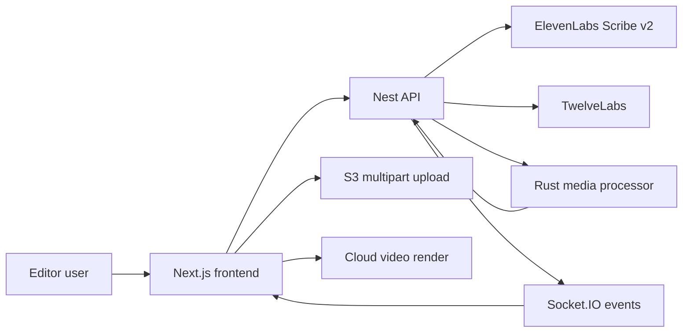

<p align="center">
  
</p>

# Framedeck

AI video editing software that turns natural language prompts into timeline edits: remove silences, add captions, analyze footage, prepare voiceovers, and render finished videos.


[Apps](#apps) - [How it works](#how-it-works) - [Getting started](#getting-started) - [Development](#development) - [Project structure](#project-structure) - [Contributing](#contributing)

## Overview

Framedeck is a Turborepo monorepo for an AI-assisted video editor. The frontend hosts the editor and video compositions, the Nest server owns the typed API and AI tool orchestration, and the Rust media processor handles fast FFmpeg audio extraction for transcription.

The shared API contract lives in `packages/api-types` and is the source of truth for both frontend hooks and server handlers through `ts-rest`.

## Apps

| App                                              | Purpose                                                                               | Local URL                                     |
| ------------------------------------------------ | ------------------------------------------------------------------------------------- | --------------------------------------------- |
| [`apps/frontend`](./apps/frontend)               | Next.js editor UI, chat assistant, uploads, preview, and render client                | `http://ai-video-editor.localhost:1355`       |
| [`apps/server`](./apps/server)                   | Nest API, WebSocket gateway, AI Gateway tools, uploads, transcription, video analysis | `http://api-ai-video-editor.localhost:1355`   |
| [`apps/media-processor`](./apps/media-processor) | Rust/Axum internal service for FFmpeg audio extraction from video files               | `http://media-ai-video-editor.localhost:1355` |
| [`packages/api-types`](./packages/api-types)     | Shared `ts-rest` contracts, Zod schemas, realtime constants, chat types               | n/a                                           |

## How it works



### Upload and processing pipeline

1. Frontend calls `POST /uploads/init` to create a multipart upload.
2. Frontend calls `POST /uploads/:uploadId/sign-parts` to sign upload chunks.
3. Browser uploads directly to S3 with `directS3Upload()`.
4. Frontend calls `POST /uploads/:uploadId/complete`.
5. Server starts ElevenLabs Scribe v2 transcription and TwelveLabs video analysis in the background.
6. WebSocket events update the editor when transcription or video analysis finishes.

Asset status flows through `pending-upload`, `uploading`, `transcribing`, `ready`, and `error`.

### Agent-driven editor

The chat assistant streams through the server-side AI Gateway. Tools from `ToolsService` emit realtime start/progress/result events, and frontend editor bridge handlers apply validated edits back to the timeline.

## Getting started

### Prerequisites

- Node.js LTS
- PNPM `10.22.0`
- Rust toolchain and Cargo
- FFmpeg
- AWS S3 credentials for uploads and cloud renders
- API keys for the AI/media providers you use: OpenAI or compatible API, ElevenLabs, TwelveLabs, Deepgram

> [!IMPORTANT]
> Copy each app's `.env.example` into a local `.env` before running the full stack. The root does not own a single combined env file.

### Install

```bash
pnpm install
```

### Run everything

```bash
pnpm dev
```

With portless enabled, the public dev URLs are stable:

- Frontend: `http://ai-video-editor.localhost:1355`
- Backend: `http://api-ai-video-editor.localhost:1355`
- Media processor: `http://media-ai-video-editor.localhost:1355`

To use direct app ports from local env files instead:

```bash
pnpm dev:direct
```

## Development

| Command                             | Description                                 |
| ----------------------------------- | ------------------------------------------- |
| `pnpm dev`                          | Run all apps through Turborepo and portless |
| `pnpm dev:direct`                   | Run all apps without portless               |
| `pnpm --filter frontend dev`        | Run only the Next.js app                    |
| `pnpm --filter server dev`          | Run only the Nest API                       |
| `pnpm --filter media-processor dev` | Run only the Rust media processor           |
| `pnpm --filter frontend exec tsc`   | Typecheck frontend                          |
| `pnpm --filter server exec tsc`     | Typecheck server                            |
| `pnpm --filter api-types build`     | Build shared API types                      |
| `pnpm build`                        | Build all apps and packages                 |
| `pnpm portless:list`                | Show active portless routes                 |

## Project structure

```text
apps/
├── frontend/          # Next.js 16, React 19, Tailwind, shadcn, Zustand, video UI
├── server/            # NestJS 11, AI SDK, Socket.IO, S3, ElevenLabs Scribe v2, TwelveLabs
└── media-processor/   # Rust/Axum, FFmpeg extraction service
packages/
└── api-types/         # Shared ts-rest contracts, Zod schemas, realtime constants
```

## API contract workflow

When adding or changing a route:

1. Update `packages/api-types/src/index.ts`.
2. Bind the route in the server with `@TsRestHandler(apiContracts.<router>.<endpoint>)`.
3. Consume it in the frontend with the generated `api` client.

> [!NOTE]
> Avoid hardcoded backend URLs in the frontend. Use the shared `api` object and env-driven base URLs.

## Useful docs

- [`apps/frontend/README.md`](./apps/frontend/README.md)
- [`apps/server/README.md`](./apps/server/README.md)
- [`apps/media-processor/README.md`](./apps/media-processor/README.md)
- [`docs/supabase`](./docs/supabase)

## Contributing

See [`CONTRIBUTING.md`](./CONTRIBUTING.md) and [`SECURITY.md`](./SECURITY.md).
