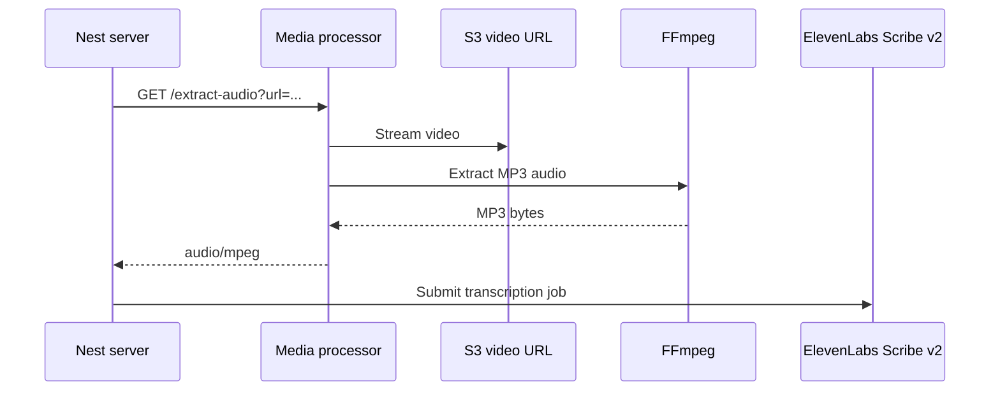

# Edith Media Processor

Internal Rust/Axum service for the Edith media pipeline. It extracts MP3 audio from uploaded video files with FFmpeg so the Nest server can send lighter audio payloads to ElevenLabs Scribe v2.


[Overview](#overview) - [Getting started](#getting-started) - [Environment](#environment) - [API](#api) - [Development](#development)

## Overview

The service exposes a small HTTP API used by `apps/server`. For video assets, the server passes a presigned S3 URL to this service, receives MP3 bytes back, then forwards the audio to ElevenLabs Scribe v2.



## Getting started

### Prerequisites

- Rust toolchain
- FFmpeg
- PNPM, when running through Turborepo scripts

Install FFmpeg on macOS:

```bash
brew install ffmpeg
```

Install hot reload tooling:

```bash
cargo install cargo-watch
```

### Run the service

From the monorepo root:

```bash
pnpm --filter media-processor dev
```

With portless enabled, open:

```text
http://media-edith.localhost:1355
```

Without portless:

```bash
PORTLESS=0 pnpm --filter media-processor dev
```

## Environment

Create `apps/media-processor/.env` from `.env.example`.

| Variable                             | Purpose                                      |
| ------------------------------------ | -------------------------------------------- |
| `PORT`                               | Direct local server port, defaults to `4005` |
| `RUST_MEDIA_PROCESSOR_PORT`          | Legacy fallback port                         |
| `REMOTION_AWS_ACCESS_KEY_ID`         | AWS access key                               |
| `REMOTION_AWS_SECRET_ACCESS_KEY`     | AWS secret key                               |
| `REMOTION_AWS_BUCKET_NAME`           | S3 bucket name                               |
| `REMOTION_AWS_REGION`                | AWS region, defaults to `us-east-1`          |
| `REMOTION_AWS_TRANSFER_ACCELERATION` | Whether S3 Transfer Acceleration is enabled  |

> [!NOTE]
> The current runtime path uses presigned URLs and FFmpeg extraction. AWS env vars are kept aligned with the rest of the media pipeline.

## API

### Health check

```http
GET /health
```

Returns `OK`.

### Extract audio

```http
GET /extract-audio?url=<presigned-s3-url>
```

Returns MP3 audio bytes.

| Response         | Description                  |
| ---------------- | ---------------------------- |
| `200 audio/mpeg` | Audio extracted successfully |
| `503 text/plain` | FFmpeg is unavailable        |
| `500 text/plain` | FFmpeg extraction failed     |

## Development

| Command                               | Description                 |
| ------------------------------------- | --------------------------- |
| `pnpm --filter media-processor dev`   | Run with hot reload         |
| `pnpm --filter media-processor build` | Build the release binary    |
| `pnpm --filter media-processor lint`  | Run `cargo clippy`          |
| `pnpm --filter media-processor test`  | Run `cargo test`            |
| `cargo run`                           | Run directly in debug mode  |
| `cargo build --release`               | Build optimized binary      |
| `cargo doc --open`                    | Generate and open Rust docs |

## Project structure

```text
src/
├── main.rs              # Server bootstrap, CORS, body limits, tracing
├── config.rs            # Environment parsing
├── routes/
│   ├── mod.rs           # Route aggregation and shared app services
│   └── upload.rs        # /extract-audio route
└── services/
    ├── mod.rs           # Service exports
    └── ffmpeg.rs        # FFmpeg availability and audio extraction
```

## FFmpeg behavior

The extraction command is optimized for large remote videos:

- Low probe size for faster format detection.
- Short analyze duration.
- HTTP reconnection flags.
- Multi-threaded decoding.

The endpoint returns the extracted MP3 as a binary response and does not persist the media file locally.
