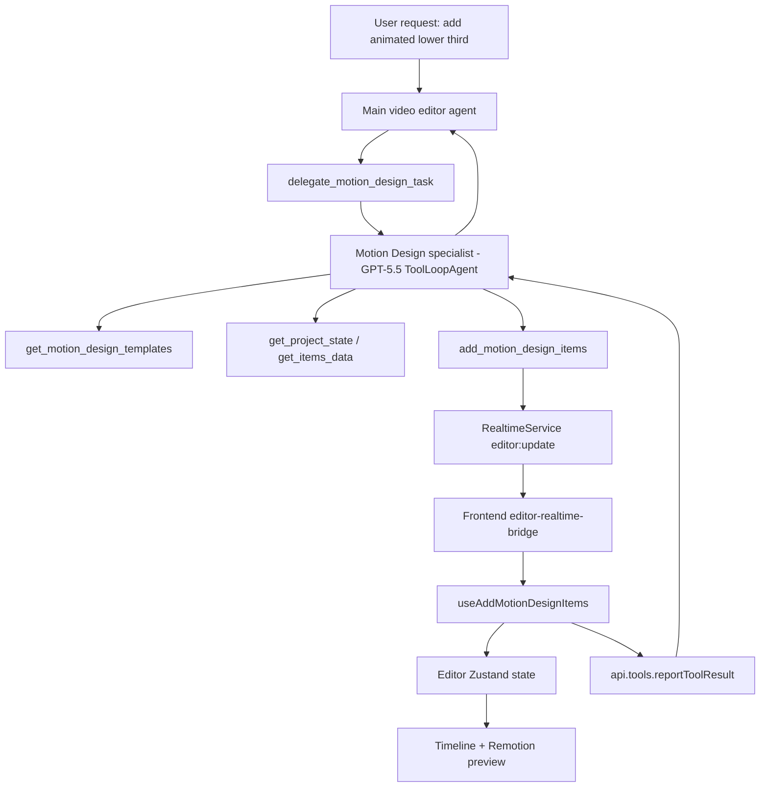

# Motion Design Panel et sous-agent specialist

Date: 2026-05-15
Statut: design approuvé pour documentation, pas encore implémenté
Décision proposée: panneau catalogue compact + sous-agent Motion Design GPT-5.5

## Résumé

On veut donner à Edith la capacité d'ajouter du motion design au montage, à la fois manuellement depuis l'interface et automatiquement via l'agent IA.

La direction recommandée est simple:

- créer un nouveau panneau `Motion` dans la sidebar, au même niveau que Assets, Text, Shapes, Images et Captions;
- afficher un catalogue de presets motion design pré-approuvés;
- permettre à l'utilisateur d'ajouter un preset manuellement à la timeline au playhead;
- créer un nouveau type d'item timeline `motion-design`;
- exposer le même catalogue au sous-agent via un outil spécialiste `get_motion_design_templates`;
- garder l'agent principal comme orchestrateur;
- ajouter un sous-agent specialist `motion-design` basé sur GPT-5.5, avec ses propres outils limités.

Le point clé: le main agent ne doit pas manipuler directement les détails motion design. Il détecte l'intention, délègue à `delegate_motion_design_task`, puis le sous-agent spécialiste choisit un preset, le configure, l'ajoute ou le met à jour sur la timeline.

## Ce qui a été investigué

### Remotion Bits

Sources:

- [Remotion Bits Getting Started](https://remotion-bits.dev/docs/getting-started/)
- [av/remotion-bits sur GitHub](https://github.com/av/remotion-bits)

Remotion Bits est une librairie de composants d'animation pour Remotion. Elle fournit des composants et exemples prêts à adapter pour:

- animations de texte: fade in, blur in, word by word, character by character, glitch, typewriter;
- transitions gradient: linear, radial, conic;
- particules: confetti, snow, fountain, fireflies, grid particles;
- motion/stagger: card stack, grid stagger, slide from left;
- scènes 3D: basic 3D scene, carousel, Ken Burns, terminal 3D.

La documentation indique deux modes d'installation:

- installer le package `remotion-bits`;
- ou copier des composants individuels via `jsrepo` depuis le registry Remotion Bits.

Le repo expose aussi un CLI et un MCP. Le CLI/MCP permet de rechercher des bits puis de récupérer le code source d'un bit précis. C'est utile pour constituer notre catalogue initial, mais ce ne doit pas devenir un système d'exécution runtime arbitraire.

Recommandation sécurité/maintenabilité: utiliser Remotion Bits comme source de composants et d'inspiration au moment du développement, puis intégrer une liste whitelistée de templates compilés dans notre codebase. L'agent ne devrait jamais injecter du TSX récupéré dynamiquement dans le rendu vidéo.

### Remotion

Sources:

- [Remotion useCurrentFrame](https://www.remotion.dev/docs/use-current-frame)
- [Remotion Sequence](https://www.remotion.dev/docs/sequence)

Les composants motion doivent suivre les règles Remotion:

- les animations sont calculées à partir de `useCurrentFrame()` et `useVideoConfig()`;
- les items sont déjà rendus dans des `<Sequence>` via le layer system existant;
- dans une `Sequence`, `useCurrentFrame()` retourne un frame local à cette séquence;
- les durées doivent rester en frames côté rendu, avec conversions secondes <-> frames côté outils;
- pas de CSS animation runtime, transition CSS ou Tailwind animation class pour les mouvements importants;
- les composants doivent être déterministes et compatibles Lambda.

Le rendu actuel de l'app enveloppe déjà chaque item timeline dans une `Sequence`, ce qui est parfait pour un item `motion-design`: le preset peut raisonner localement depuis frame 0, quelle que soit sa position réelle sur la timeline.

### AI SDK, AI Gateway et GPT-5.5

Sources:

- [AI SDK ToolLoopAgent](https://ai-sdk.dev/docs/reference/ai-sdk-core/tool-loop-agent)
- [Vercel AI Gateway models and providers](https://vercel.com/docs/ai-gateway/models-and-providers)
- [Vercel AI Gateway GPT-5.5](https://vercel.com/ai-gateway/models/gpt-5.5/providers)
- `.cursor/rules/prompt-engineering-gpt-5.5.mdc`

Le repo utilise déjà `ToolLoopAgent` pour créer des spécialistes one-shot. C'est le bon modèle pour le motion design: un agent autonome, avec un petit set d'outils, qui itère jusqu'à compléter l'édition ou retourner un blocage clair.

Le modèle demandé est `openai/gpt-5.5`. Il existe déjà dans `apps/server/src/ai-gateway/models-config.ts`, et Vercel AI Gateway le documente comme modèle avec tool use et raisonnement. Le prompt spécialiste doit rester outcome-first:

- objectif clair;
- contraintes de rendu;
- outils disponibles;
- critères de succès;
- sortie JSON compacte;
- comportement si l'information manque;
- budget de boucles raisonnable.

## État actuel du repo

### Système de sous-agents existant

Le repo a déjà un pattern solide pour les spécialistes:

- `delegate_text_overlay_task`
- `delegate_image_picture_task`
- `delegate_shape_overlay_task`

Fichiers principaux:

- `apps/server/src/ai-gateway/tools/tools.service.ts`
- `apps/server/src/ai-gateway/tools/tool-creators/text.tools.ts`
- `apps/server/src/ai-gateway/tools/tool-creators/image-picture.tools.ts`
- `apps/server/src/ai-gateway/tools/tool-creators/shape.tools.ts`
- `apps/server/src/prompts/prompts.service.ts`
- `packages/api-types/src/realtime.constants.ts`
- `apps/frontend/src/app/projects/[project-id]/_editor-container/editor/realtime/editor-realtime-bridge.tsx`

Le main agent expose les outils de délégation, mais pas les outils bas niveau. Les outils bas niveau sont donnés seulement au spécialiste concerné.

Le motion design doit suivre exactement cette logique.

### Panneaux existants

La sidebar contient déjà:

- Assets;
- Text;
- Shapes;
- Images;
- Captions;
- Inspector.

Fichiers principaux:

- `apps/frontend/src/app/projects/[project-id]/_editor-container/editor/sidebar-panel/editor-sidebar.tsx`
- `apps/frontend/src/app/projects/[project-id]/_editor-container/editor/sidebar-panel/sidebar-panel-context.tsx`
- `apps/frontend/src/app/projects/[project-id]/_editor-container/editor/sidebar-panel/sidebar-panels.tsx`
- `apps/frontend/src/app/projects/[project-id]/_editor-container/editor/sidebar-panel/text-panel.tsx`
- `apps/frontend/src/app/projects/[project-id]/_editor-container/editor/sidebar-panel/solid-panel.tsx`
- `apps/frontend/src/app/projects/[project-id]/_editor-container/editor/sidebar-panel/image-panel.tsx`

Le panneau Motion doit reprendre ce modèle: une sidebar de 300px environ, une action d'ajout, une liste de templates, puis un inspecteur si un item motion est sélectionné.

### Timeline et rendu

Fichiers principaux:

- `apps/frontend/src/app/projects/[project-id]/_editor-container/editor/items/item-type.ts`
- `apps/frontend/src/app/projects/[project-id]/_editor-container/editor/items/layer.tsx`
- `apps/frontend/src/app/projects/[project-id]/_editor-container/editor/timeline/timeline-item-preview.tsx`
- `apps/frontend/src/app/projects/[project-id]/_editor-container/remotion/Root.tsx`
- `apps/frontend/src/app/projects/[project-id]/_editor-container/remotion/main.tsx`
- `apps/frontend/src/app/projects/[project-id]/_editor-container/remotion/canvas/composition.tsx`

Aujourd'hui, `item.type` supporte image, text, video, solid, captions, audio et gif. Il faudra ajouter `motion-design`, puis brancher un `MotionDesignLayer` dans `InnerLayer`.

## Direction UI validée

La direction recommandée est l'option "Catalog-first panel".

Structure:

```text
Sidebar
  Assets
  Text
  Shapes
  Images
  Motion   <- nouveau
  Captions

Motion Panel
  Search presets
  Categories: All / Text FX / Transitions / Particles / Data / 3D
  Preset card
    preview thumbnail
    title
    category
    duration
    Add at playhead
  Selected motion item inspector
    text/content
    colors
    duration
    position preset
    advanced controls by template
```

Exemples de cartes:

| Preset | Catégorie | Usage |
| --- | --- | --- |
| Blur Word Title | Text FX | Titre animé d'intro ou de chapitre |
| Lower Third Slide | Overlay | Nom + rôle + bandeau animé |
| Counter Pop | Data | Nombre ou métrique qui grimpe |
| Confetti Hit | Moment | Accent celebratory sur un temps fort |
| Gradient Wash | Transition | Overlay de transition plein écran |
| Particle Accent | Particles | Effet léger autour d'un sujet ou texte |
| Typewriter Terminal | Text FX | Texte technique, CLI ou code vibe |
| 3D Card Stack | 3D | Présenter plusieurs screenshots/cartes |

Flux manuel:

```text
User opens Motion panel
  -> searches or filters templates
  -> clicks template card
  -> edits quick controls if needed
  -> clicks Add
  -> app creates a motion-design item at the current playhead
  -> item is selected
  -> user can drag, trim, duplicate, delete, and edit it like other overlays
```

## Modèle de données proposé

Créer un item dédié est préférable à l'ajout de champs motion sur chaque item existant.

Raisons:

- un preset peut combiner texte, shape, gradient, particules ou 3D dans un seul rendu;
- la timeline reste claire: un effet motion est un item manipulable;
- le spécialiste peut créer et modifier un objet unique;
- on évite de polluer `TextItem`, `ImageItem` et `SolidItem` avec trop de variantes.

Forme conceptuelle:

```ts
type MotionDesignItem = BaseItem & CanHaveRotation & {
  type: 'motion-design';
  templateId: MotionDesignTemplateId;
  props: MotionDesignTemplateProps;
  left: number;
  top: number;
  width: number;
  height: number;
  opacity: number;
  fadeInDurationInSeconds: number;
  fadeOutDurationInSeconds: number;
};
```

Le `templateId` pointe vers une registry locale:

```ts
type MotionDesignTemplate = {
  id: MotionDesignTemplateId;
  label: string;
  category: MotionDesignCategory;
  description: string;
  tags: string[];
  defaultDurationInFrames: number;
  defaultProps: MotionDesignTemplateProps;
  controls: MotionDesignControlDefinition[];
  render: React.FC<MotionDesignRenderProps>;
};
```

Important: `props` doit être validé par template. Chaque template a son propre schéma Zod côté shared/API ou au minimum une validation stricte côté frontend/backend avant mutation.

## Catalogue de templates

Créer une registry locale dans le frontend, par exemple:

```text
apps/frontend/src/app/projects/[project-id]/_editor-container/editor/items/motion-design/
  motion-design-item-type.ts
  motion-design-layer.tsx
  motion-design-templates.ts
  motion-design-template-controls.ts
  create-motion-design-item.ts
```

La registry contient uniquement les templates supportés par l'app.

Premier pack MVP:

- `blur-word-title`
- `lower-third-slide`
- `counter-pop`
- `confetti-hit`
- `gradient-wash`
- `particle-accent`
- `typewriter-terminal`
- `card-stack-3d` si performant et stable, sinon le garder pour phase 2.

Remotion Bits peut servir à construire ces composants. On peut installer `remotion-bits` si on veut consommer le package directement, ou copier/adaptater les composants nécessaires avec `jsrepo`. La version la plus sûre est de copier/adaptater seulement les primitives nécessaires pour éviter de dépendre d'un catalogue externe au runtime.

## Outils IA proposés

### Main agent

Ajouter un seul outil exposé au main agent:

```text
delegate_motion_design_task
```

Input:

- `userRequest`
- `projectId`
- `conversationContext`
- `targetItemIds`
- `timeRange`
- `placementHint`
- `styleHint`
- `templateHint`
- `projectStateSnapshot`

Le prompt principal doit dire:

- pour motion design, transitions visuelles, kinetic typography, lower thirds animés, compteurs animés, particules, intros/outros graphiques ou 3D cards, déléguer à `delegate_motion_design_task`;
- ne pas utiliser les outils bas niveau motion depuis le main agent.

### Sous-agent Motion Design

Créer:

```text
apps/server/src/ai-gateway/tools/tool-creators/motion-design-agent.ts
apps/server/src/ai-gateway/tools/tool-creators/motion-design.tools.ts
apps/server/src/ai-gateway/tools/tool-creators/motion-design-validation.ts
```

Le sous-agent utilise `ToolLoopAgent` avec `openai/gpt-5.5`.

Outils spécialiste:

- `get_project_state`
- `get_items_data`
- `get_motion_design_templates`
- `select_timeline_items`
- `place_timeline_items`
- `delete_items`
- `add_motion_design_items`
- `update_motion_design_items`

Le spécialiste ne reçoit pas les outils image/text/shape bas niveau par défaut. Si un template doit créer du texte animé, il crée un `motion-design` item avec props textuelles, pas un `text` item.

Sortie compacte:

```ts
type MotionDesignAgentResult = {
  status: 'success' | 'partial_success' | 'needs_clarification' | 'error';
  createdItemIds: string[];
  updatedItemIds: string[];
  deletedItemIds: string[];
  selectedItemIds: string[];
  usedTemplateIds: string[];
  summary: string;
  unresolvedIssue?: string;
};
```

## Flux technique



## Fichiers à modifier

### Shared API types

- `packages/api-types/src/realtime.constants.ts`
  - ajouter `delegateMotionDesignTask`
  - ajouter `getMotionDesignTemplates`
  - ajouter `addMotionDesignItems`
  - ajouter `updateMotionDesignItems`
  - ajouter les payloads realtime

- `packages/api-types/src/index.ts`
  - ajouter `motion-design` au project state digest si le schéma y énumère les item types
  - ajouter les schémas de templates si on veut les partager proprement

### Server

- `apps/server/src/prompts/prompts.service.ts`
  - ajouter la règle de délégation motion design
  - inclure les motion design items dans le format de project state

- `apps/server/src/ai-gateway/tools/tools.service.ts`
  - exposer seulement `delegate_motion_design_task` dans le main tool map
  - garder les outils add/update motion dans le specialist tool map

- `apps/server/src/ai-gateway/tools/tool-creators/index.ts`
  - exporter les nouveaux tool creators

- nouveaux fichiers:
  - `motion-design-agent.ts`
  - `motion-design.tools.ts`
  - `motion-design-validation.ts`
  - `motion-design.tools.spec.ts`

### Frontend

- `apps/frontend/src/app/projects/[project-id]/_editor-container/editor/sidebar-panel/sidebar-panel-context.tsx`
  - ajouter le panel type `motion-design`

- `apps/frontend/src/app/projects/[project-id]/_editor-container/editor/sidebar-panel/editor-sidebar.tsx`
  - ajouter l'icône Motion

- `apps/frontend/src/app/projects/[project-id]/_editor-container/editor/sidebar-panel/sidebar-panels.tsx`
  - router vers `MotionDesignPanel`

- nouveau panneau:
  - `apps/frontend/src/app/projects/[project-id]/_editor-container/editor/sidebar-panel/motion-design-panel.tsx`

- nouveaux items:
  - `apps/frontend/src/app/projects/[project-id]/_editor-container/editor/items/motion-design/motion-design-item-type.ts`
  - `apps/frontend/src/app/projects/[project-id]/_editor-container/editor/items/motion-design/create-motion-design-item.ts`
  - `apps/frontend/src/app/projects/[project-id]/_editor-container/editor/items/motion-design/motion-design-layer.tsx`
  - `apps/frontend/src/app/projects/[project-id]/_editor-container/editor/items/motion-design/motion-design-templates.ts`

- timeline/rendu:
  - `apps/frontend/src/app/projects/[project-id]/_editor-container/editor/items/item-type.ts`
  - `apps/frontend/src/app/projects/[project-id]/_editor-container/editor/items/layer.tsx`
  - `apps/frontend/src/app/projects/[project-id]/_editor-container/editor/timeline/timeline-item-preview.tsx`

- realtime:
  - `apps/frontend/src/app/projects/[project-id]/_editor-container/editor/realtime/editor-realtime-bridge.tsx`
  - `apps/frontend/src/app/projects/[project-id]/_editor-container/editor/realtime/motion-design-realtime-guards.ts`
  - `apps/frontend/src/app/projects/[project-id]/_editor-container/editor/hooks/use-add-motion-design-items.ts`
  - `apps/frontend/src/app/projects/[project-id]/_editor-container/editor/hooks/use-update-motion-design-items.ts`

- project state:
  - `apps/frontend/src/app/projects/[project-id]/_editor-container/editor/utils/build-project-state-digest.ts`

## Plan d'implémentation

### Phase 1: modèle et rendu local

Objectif: créer un `motion-design` item manipulable manuellement.

- ajouter le type `MotionDesignItem`;
- créer la registry de templates;
- créer `MotionDesignLayer`;
- brancher le rendu dans `InnerLayer`;
- ajouter la preview timeline;
- vérifier dans le player local que l'item se rend correctement.

### Phase 2: panneau manuel

Objectif: permettre à l'utilisateur d'ajouter et modifier un preset sans IA.

- ajouter le bouton Motion dans la sidebar;
- créer `MotionDesignPanel`;
- afficher les catégories et cartes de presets;
- ajouter un bouton `Add` qui crée l'item au playhead;
- sélectionner automatiquement l'item créé;
- afficher les contrôles pertinents du template sélectionné.

### Phase 3: realtime tools

Objectif: rendre le même item contrôlable par agent.

- ajouter les noms d'outils et payloads dans `api-types`;
- créer les hooks frontend add/update;
- brancher `editor-realtime-bridge`;
- retourner tool result avec project state digest mis à jour.

### Phase 4: sous-agent GPT-5.5

Objectif: isoler l'intelligence motion design du main prompt.

- créer `createDelegateMotionDesignTaskTool`;
- créer `buildMotionDesignSpecialistPrompt`;
- utiliser `ToolLoopAgent`;
- forcer le modèle `openai/gpt-5.5` pour ce spécialiste;
- donner uniquement les outils motion/read/timeline nécessaires;
- ajouter tests serveur pour vérifier que le main agent expose seulement la délégation.

### Phase 5: polish et validation

Objectif: rendre le feature fiable.

- ajouter tests de validation Zod;
- vérifier `pnpm --filter api-types build`;
- vérifier `pnpm --filter frontend exec tsc`;
- vérifier `pnpm --filter server exec tsc`;
- tester un render local Remotion;
- si les composants rendus sont inclus dans le bundle Lambda, redéployer le site Remotion avant de valider un render Lambda.

## Prompt du sous-agent

Le prompt doit rester court et orienté résultat.

Structure recommandée:

```text
You are the Motion Design specialist for Edith.

Outcome:
Create or update timeline motion-design items that satisfy the user's visual animation request while keeping the video readable, polished, and render-safe.

Use only the available motion design templates. Do not invent template IDs.
Prefer one clean motion item over many overlapping items.
Use get_motion_design_templates before choosing a template unless the template ID is already explicit.
Use get_project_state and get_items_data when placement, timing, selected items, or surrounding context matters.

Success means:
- the selected template fits the user request
- timing is aligned to the requested time range, playhead, or selected item
- props are valid for the template
- the created/updated items are selected when useful
- the final result is compact JSON

If the request is ambiguous but safe defaults are enough, proceed.
Ask for clarification only when the missing choice materially changes the edit.
```

Le vrai prompt devrait aussi inclure les règles Remotion:

- pas d'animation CSS pour le rendu final;
- utiliser frames/durations cohérentes;
- garder les effets lisibles;
- limiter particules/3D quand le rendu serait trop lourd;
- ne pas couvrir les visages/sujets importants sauf demande explicite.

## Gestion des erreurs

Cas à gérer:

- template inconnu;
- props invalides pour un template;
- durée nulle ou négative;
- item cible inexistant;
- tentative de mise à jour d'un item non motion-design;
- manque de contexte sur le timing;
- template 3D/particles trop lourd pour le rendu.

Comportement:

- retourner `needs_clarification` si l'agent ne peut pas choisir sans décision utilisateur;
- retourner `partial_success` si certains items ont été modifiés mais pas tous;
- toujours inclure `unresolvedIssue` en cas d'échec ou succès partiel;
- ne jamais créer un item invisible sans l'indiquer.

## Contraintes produit

- Pas de runtime code injection depuis Remotion Bits ou un MCP externe.
- Le catalogue IA et le catalogue UI doivent provenir de la même registry.
- Le panneau manuel doit fonctionner même si l'agent IA est indisponible.
- Le sous-agent ne doit pas accéder aux outils text/image/shape bas niveau par défaut.
- Les presets doivent être éditables après ajout.
- Les motion items doivent être drag/trim/delete comme les autres items timeline.
- Les templates lourds doivent être opt-in ou phase 2.

## Approches comparées

### A. Registry whitelistée locale

Recommandé.

Avantages:

- fiable en rendu Lambda;
- type-safe;
- facile à exposer au panneau et à l'agent;
- pas de code externe exécuté au runtime;
- testable.

Inconvénient:

- il faut intégrer les templates un par un.

### B. Fetch Remotion Bits au build/dev time

Possible plus tard.

Avantages:

- accélère l'ajout de nouveaux presets;
- garde un lien avec l'écosystème Remotion Bits.

Inconvénients:

- nécessite un processus d'import, review et adaptation;
- il faut figer les versions avant production.

### C. Fetch et exécution dynamique au runtime

Non recommandé.

Avantage:

- très flexible en théorie.

Inconvénients:

- risque sécurité;
- rendu non déterministe;
- validation difficile;
- incompatible avec un éditeur vidéo fiable.

## Critères d'acceptation

Le feature est prêt quand:

- l'utilisateur peut ouvrir le panneau Motion;
- le catalogue affiche au moins 6 presets;
- l'utilisateur peut ajouter un preset au playhead;
- l'item apparaît dans la timeline;
- l'item est visible dans le canvas/remotion preview;
- l'utilisateur peut sélectionner, déplacer, trim, supprimer et modifier l'item;
- le main agent expose `delegate_motion_design_task`;
- le sous-agent GPT-5.5 peut récupérer les templates, ajouter et mettre à jour un motion item;
- les outils add/update motion ne sont pas exposés au main agent;
- les tests types/build serveur/frontend passent;
- un render Remotion local valide au moins 2 templates: un texte animé et un effet visuel.

## Décisions ouvertes

1. Le premier pack doit-il inclure la 3D dès le MVP, ou rester text/overlay/particles léger?
2. Les thumbnails doivent-ils être de simples previews CSS statiques au début, ou des micro-previews Remotion animées?
3. Le catalogue doit-il être global au produit ou configurable par workspace/brand kit plus tard?

Recommandation actuelle:

- garder la 3D pour phase 2;
- commencer avec thumbnails statiques ou très légères;
- garder un catalogue global, puis ajouter la personnalisation brand kit plus tard.

## Notes de self-review

- Le scope est centré sur un seul nouveau type d'item et un seul nouveau spécialiste.
- Le document évite l'exécution runtime de code externe.
- Le panneau manuel et l'agent utilisent la même source de vérité.
- Le plan suit les patterns existants text/image/shape.
- Les décisions ouvertes ne bloquent pas le MVP.
